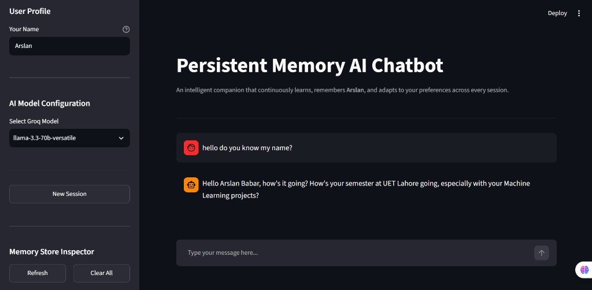
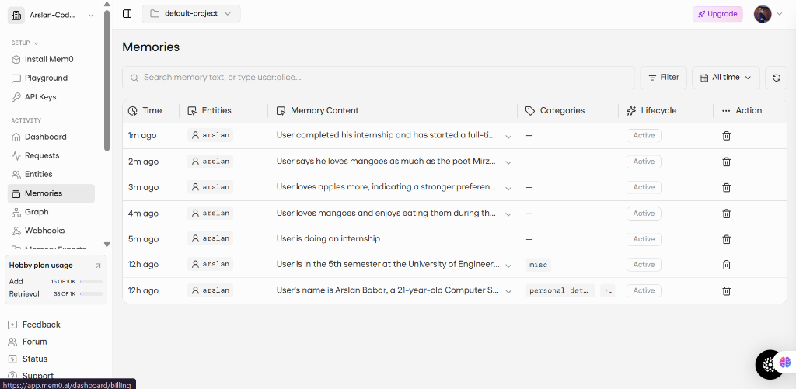
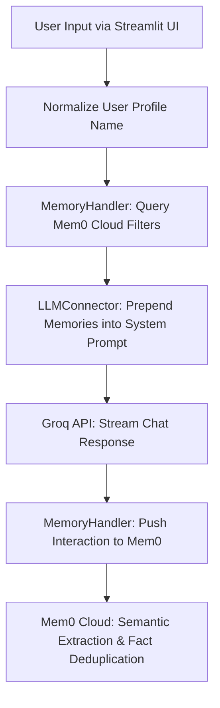

# 🧠 Persistent Memory AI Chatbot

[](https://python.org)
[](https://streamlit.io)
[](https://groq.com)
[](https://mem0.ai)
[](LICENSE)
[](https://github.com/Arslan-Codes097)

An intelligent conversational AI assistant built with **Streamlit**, **Groq LLM API**, and **Mem0 Cloud Platform**. Unlike traditional stateless chatbots that forget everything when refreshed, this chatbot automatically extracts, stores, and recalls user facts, preferences, and personal details across past conversations and application restarts.

---

## 🌐 Live Demo

- **GitHub Repo:** [https://github.com/Arslan-Codes097/Persistent-Memory-AI-Chatbot](https://github.com/Arslan-Codes097/Persistent-Memory-AI-Chatbot)
- **Live APP:** https://persistent-memory-ai-chatbot.streamlit.app/

---

## 📸 Screenshots & Verification Proof

| 🤖 Application UI in Action | ⚡ Mem0 Cloud Dashboard Verification |
| :---: | :---: |
|  |  |
| *Chatbot seamlessly recalling user name, university, semester, and projects.* | *Live Mem0 Cloud dashboard verifying extracted facts and user entities.* |

---

## ✨ Key Features

- 🧠 **Persistent Long-Term Memory:** Integrates Mem0 Cloud Platform to store user facts across sessions and app reboots.
- ⚡ **Dynamic Context Injection:** Automatically searches and injects relevant user memories into system instructions before generating LLM responses.
- 🔄 **Semantic Memory Deduplication & Overwrite:** Updates outdated facts automatically (e.g., updating user age from 25 to 26 without creating duplicate entries).
- 👤 **Multi-User Isolation:** Switch profiles seamlessly using the **Your Name** sidebar control to maintain distinct, isolated memory stores.
- 🔍 **Live Memory Inspector:** Inspect stored facts in real-time or delete them using sidebar controls (**Refresh** & **Clear All**).
- 🚀 **Streamlit Cloud Compatible:** Uses cloud-managed Mem0 Platform API so memory never dies even on ephemeral host runtimes.

---

## 🛠️ Tech Stack Table

| Category | Technology | Purpose / Role |
| :--- | :--- | :--- |
| **Frontend UI** | Streamlit | Responsive, stateful chatbot user interface |
| **LLM Backend** | Groq API (`llama-3.3-70b-versatile`) | Ultra-fast LLM response streaming |
| **Memory Engine** | Mem0 Cloud Platform (`mem0ai`) | Graph/Vector fact extraction & semantic memory recall |
| **Language & Env** | Python 3.9+ / `python-dotenv` | Core application logic and environment variables management |

---

## ⚙️ How It Works

1. **User Query Input:** User sends a message via Streamlit chat UI.
2. **User Identity Normalization:** Converts user name into a sanitized slug for scoping memories.
3. **Memory Retrieval:** Queries Mem0 Cloud Platform for relevant memories using standard v2 filters (`filters={'user_id': user_id}`).
4. **Context Injection:** Formats retrieved facts into system prompt instructions.
5. **LLM Generation:** Calls Groq API to stream natural, personalized responses back to the user.
6. **Background Memory Extraction:** Asynchronously pushes the conversation turn to Mem0 for automated fact extraction and semantic updates.

---

## 🏗️ Project Architecture



---

## 📂 Project Structure

```text
Persistent-Memory-AI-Chatbot/
├── assets/
│   ├── streamlit_chatbot_ui.png     # Screenshot of Streamlit application UI
│   └── mem0_dashboard_proof.png     # Screenshot of Mem0 Cloud Dashboard proof
├── app.py                           # Main Streamlit UI & chat orchestration
├── memory_handler.py                # Direct Mem0 Platform v2 API integration
├── llm_connector.py                 # Groq API streaming connector & context injector
├── .env                             # Local environment secrets (GROQ_API_KEY & MEM0_API_KEY)
├── requirements.txt                 # Project dependencies
└── README.md                        # Project documentation
```

---

## 💻 Local Setup & Installation

### 1. Prerequisites
- Python 3.9+
- Groq API Key ([console.groq.com](https://console.groq.com))
- Mem0 API Key ([app.mem0.ai](https://app.mem0.ai))

### 2. Clone Repository
```bash
git clone https://github.com/Arslan-Codes097/Persistent-Memory-AI-Chatbot.git
cd Persistent-Memory-AI-Chatbot
```

### 3. Install Dependencies
```bash
pip install -r requirements.txt
```

### 4. Configure Environment Variables
Create a `.env` file in the root directory:
```env
GROQ_API_KEY=your_groq_api_key_here
MEM0_API_KEY=your_mem0_api_key_here
```

### 5. Run Application
```bash
streamlit run app.py
```

---

## 👤 Author & Credits

Developed by **Arslan Babar**

- **GitHub:** [@Arslan-Codes097](https://github.com/Arslan-Codes097)
- **Project Repository:** [Persistent-Memory-AI-Chatbot](https://github.com/Arslan-Codes097/Persistent-Memory-AI-Chatbot)
